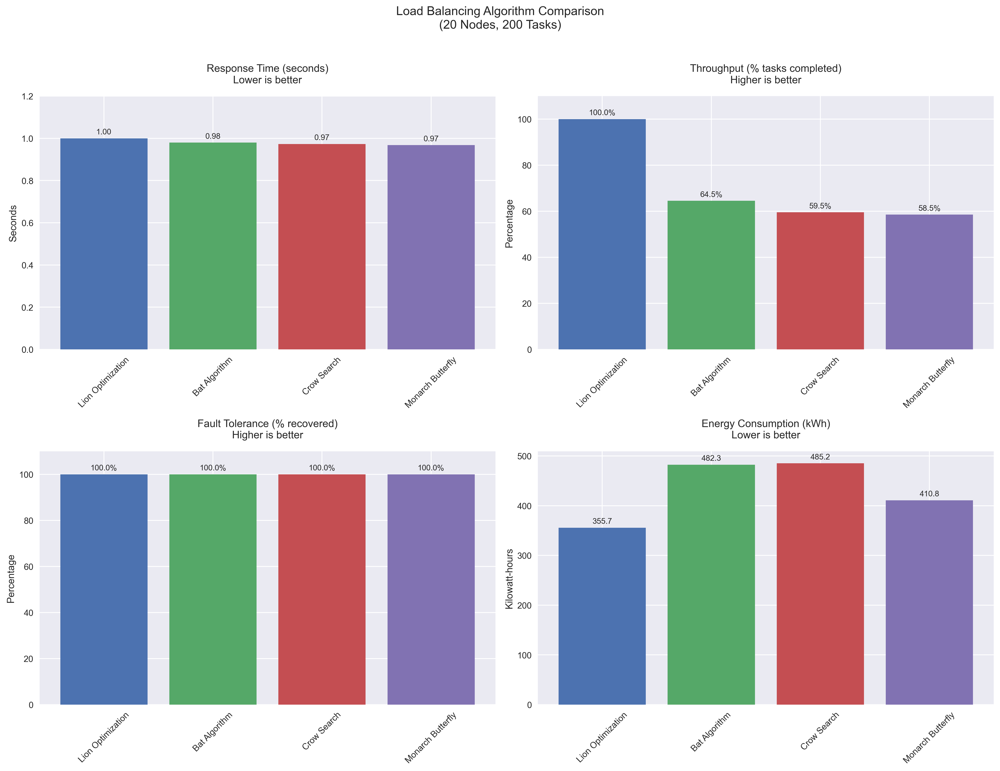
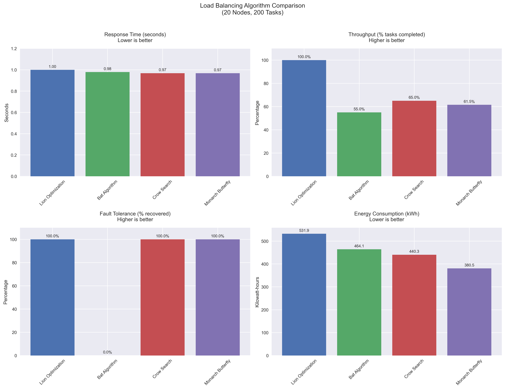
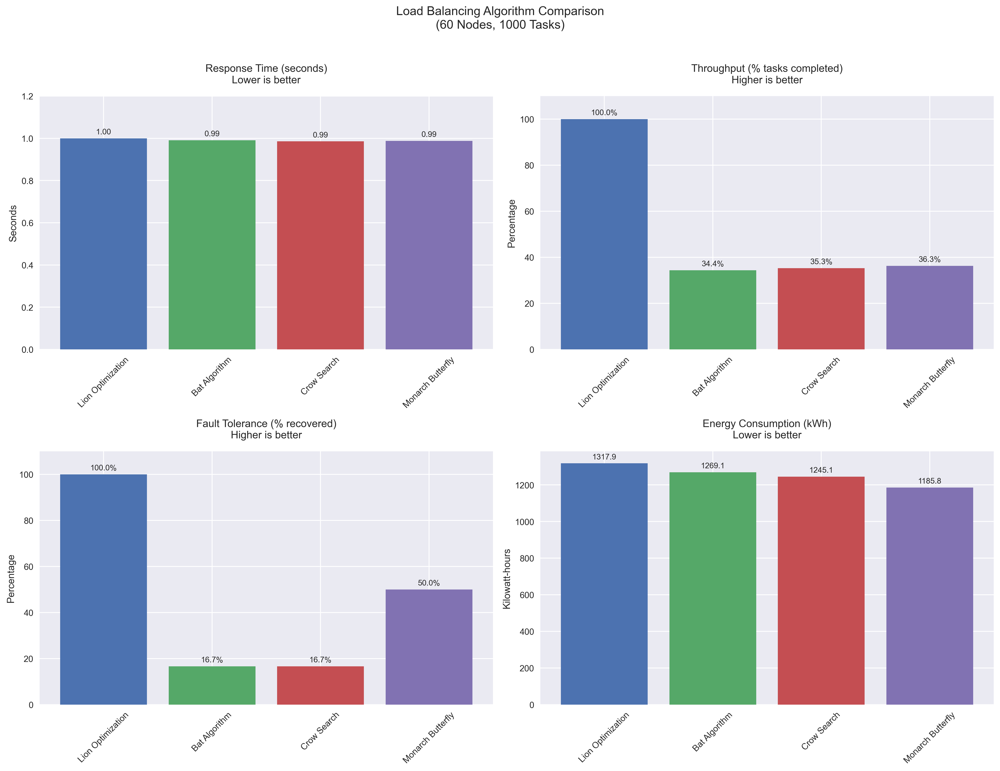

Cloud Load Balancing Optimization

This project explores metaheuristic algorithms for optimizing cloud load balancing in a simulated environment. The goal is to improve resource distribution, reduce response time, and enhance system reliability under dynamic workloads and node failures.

🚀 Features
Implemented Lion Optimization, Bat, Crow, and Butterfly algorithms
Simulated multi-node cloud environment with random workloads

Compared performance across:
⚡ Response Time

📊 Throughput

🔋 Energy Consumptio

🔒 Fault Tolerance under node failures

Visualized algorithm performance with detailed comparison graphs

🛠️ Tech Stack
Language: Python
Libraries: NumPy, Matplotlib, Pandas

## 📊 Results
Comparison of algorithms on response time, throughput, and fault tolerance:

 

🔮 Future Work

Integration with real cloud simulators (CloudSim, Docker Swarm, Kubernetes)

Hybrid optimization (e.g., combining Lion + Bat for adaptive strategies)

Multi-objective optimization (cost + latency + energy)

📌 References

Metaheuristic optimization techniques in cloud computing

Research papers on load balancing algorithms
